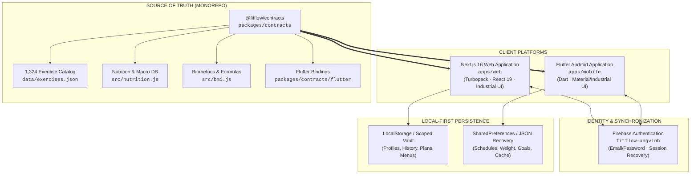

# FITFLOW

<div align="center">

**Local-First Kinetic Training Engine & Cross-Platform Fitness Companion**

[](https://nextjs.org/)
[](https://nextjs.org/docs/app/api-reference/turbopack)
[](https://react.dev/)
[](https://flutter.dev/)
[](https://firebase.google.com/)
[](packages/contracts/test)
[](LICENSE)

[Features](#key-features) • [Architecture](#system-architecture) • [Workout Builder](#intelligent-workout-builder) • [Cross-Platform Auth](#cross-platform-firebase-authentication) • [Quick Start](#quick-start) • [Verification](#testing--verification) • [Deployment](#deployment)

</div>

---

## Overview

**FITFLOW** is a high-performance, local-first fitness platform engineered for independent athletes and lifters. It bridges a modern **Next.js 16 Web application** and an **Android Flutter application** through a unified data contract layer and shared **Firebase Authentication**.

Built with an industrial control deck aesthetic (charcoal `#0e0e10`, precision typography, and hazard red `#ef4444` accents), FITFLOW eliminates friction, tracking fatigue, and bloated interfaces, focusing strictly on biomechanical clarity and autonomous progress.

---

## System Architecture



---

## Key Features

### ⚡ Intelligent Workout Builder (Workout Wizard)
- **3-Step Calibration Matrix**: Equipment setup $\rightarrow$ Anatomical muscle selection $\rightarrow$ Fine-tuned movement matrix.
- **Interactive Dual-View Body Map**: Vector SVG diagrams of **Anterior (Front)** and **Posterior (Back)** muscle groups with real-time selection and hazard-red highlights.
- **Dynamic Volume Customization**: Choose between 3, 4, 5, 6, or 8 target exercises per workout.
- **Physiological Split Randomizer**: Generates balanced splits (`PUSH`, `PULL`, `LEGS`, `UPPER`, `ANTAGONIST`) with one click.
- **Recovery & Fatigue Advisory**: Tracks yesterday's split and warns against training fatigued muscle chains within a 48-hour window.
- **Kinetic Synergy Engine**: Detects primary movement patterns (e.g. Pull/Lats) and suggests complementary muscle groups (Biceps, Upper Back) with a 1-click apply trigger.
- **Controlled Generation**: Starts with a clean initial state (no auto-picked exercises) letting the athlete generate calibrated routines or pick movements manually.

### 📚 Biomechanical Exercise Library
- **1,324 Movement Database**: Server-filtered search by muscle target, equipment, and movement category.
- **Motion Demonstrations**: Lazy-loaded animated media, muscle involvement diagrams, and form cues.
- **Shuffle & Replace**: Swap any exercise within a generated session for an equivalent biomechanical alternative.

### 🥗 Nutrition Engine & Meal Architect
- Curated food library with macronutrient breakdowns per 100g.
- Automated daily meal generator balancing caloric goals, protein thresholds, and micro-diversity.
- Custom food entry and local food favorites registry.

### 🧮 Comprehensive Biometric Calculators
- **BMI & Category Matrix**: Standard & metric calculations with BMI 18–35 guidance.
- **TDEE (Total Daily Energy Expenditure)**: Harris-Benedict and Mifflin-St Jeor formulas.
- **1RM (One Rep Max) Predictor**: Epley, Brzycki, and Lombardi load estimations.
- **Macronutrient Planner**: Protein/Carb/Fat ratio optimization based on athletic goals (Cut, Maintain, Bulk).
- **Target Heart-Rate Zones**: Karvonen formula zone targeting (Aerobic, Anaerobic, VO2 Max).
- **Navy Body Fat Estimator**: Circumference-based body composition analysis.

### 🔐 Unified Cross-Platform Authentication
- Powered by **Firebase Authentication** (`fitflow-ungvinh`).
- Single account works seamlessly across both Web and Mobile apps.
- Local-first architecture guarantees zero lockouts: accounts fall back gracefully to local storage if offline.

---

## Intelligent Workout Builder

The Workout Builder modal (`apps/web/components/WorkoutWizardModal.jsx`) follows a strict 3-step kinetic calibration workflow:

```
[01 EQUIPMENT]                [02 TARGET MUSCLES]               [03 EXERCISE MATRIX]
┌──────────────────┐          ┌──────────────────────┐          ┌────────────────────┐
│ Bodyweight Only  │          │ Anterior / Posterior │          │ [⚡ GENERATE]       │
│ Dumbbells / Bar  │   ───>   │ Body Map Selection   │   ───>   │ 6 Movements Loaded │
│ Cable / Machines │          │ 🎲 Random Split      │          │ Shuffle / Reorder  │
│ Pull-Up / Bands  │          │ ⚡ Recovery Warning  │          │ Start Workout →    │
└──────────────────┘          └──────────────────────┘          └────────────────────┘
```

### Biomechanical Intelligence Highlights:
1. **No Accidental Pre-Picks**: Step 3 initializes clean with an empty matrix. Athletes choose between generating calibrated movements or manually adding from the catalog.
2. **Yesterday Recovery Shield**: Tracks workout logs within the last 48 hours. If chest/shoulders were worked yesterday, an advisory banner flags them and marks muscles with `⚡`.
3. **Synergy Pairings**:
   - **PULL**: Suggests pairing *Lats & Back* with *Biceps* and *Upper Back/Traps* to complete the kinetic chain.
   - **PUSH**: Suggests pairing *Chest* with *Shoulders* and *Triceps* for cohesive pressing power.
   - **LEGS**: Suggests balancing *Quadriceps* with *Hamstrings* and *Glutes* to preserve anterior-posterior knee stability.

---

## Cross-Platform Firebase Authentication

FITFLOW connects Web and Android through a unified Firebase Auth boundary:

| Feature | Web (`apps/web`) | Android (`apps/mobile`) |
| :--- | :--- | :--- |
| **SDK** | Firebase Web Modular SDK (`v12+`) | FlutterFire `firebase_auth` (`^6.6.1`) |
| **Credentials** | Email & Password | Email & Password |
| **Password Reset** | Real email dispatch via Firebase | Real email dispatch via Firebase |
| **Offline Fallback** | LocalStorage with migration integrity | SharedPreferences with JSON backups |
| **Session Cache** | Automatic bearer token validation | `currentUser` persistent listener |

### Firebase Configuration Setup:
1. Ensure the Firebase project `fitflow-ungvinh` has **Email/Password** enabled in [Firebase Console $\rightarrow$ Authentication $\rightarrow$ Sign-in method](https://console.firebase.google.com/project/fitflow-ungvinh/authentication).
2. Web credentials reside in `apps/web/lib/firebase.js`.
3. Mobile configuration resides in `apps/mobile/lib/firebase_options.dart`.

---

## Project Structure

```text
VinceCore/
├── apps/
│   ├── web/                          # Next.js 16 (Turbopack) Web Application
│   │   ├── app/                      # App Router (pages: /, /nutrition, /account, /auth, /about)
│   │   │   ├── globals.css           # Industrial Control Deck styling
│   │   │   └── page.jsx              # Main dashboard & workout runner
│   │   ├── components/               # React UI Components
│   │   │   └── WorkoutWizardModal.jsx# Intelligent 3-Step Workout Builder
│   │   ├── lib/                      # Utilities, Auth & Firebase bindings
│   │   └── test/                     # Web workspace regression unit tests
│   │
│   └── mobile/                       # Flutter Android Application
│       ├── lib/
│       │   ├── core/                 # Fitness repository & storage adapters
│       │   ├── features/             # Feature modules (Auth, Home, Workout)
│       │   ├── widgets/              # Reusable industrial Flutter widgets
│       │   └── firebase_options.dart # Generated FlutterFire options
│       └── test/                     # Flutter unit & widget tests
│
├── packages/
│   └── contracts/                    # Canonical Source of Truth
│       ├── data/exercises.json       # 1,324 curated exercises
│       ├── src/nutrition.js          # Food nutrition database
│       ├── src/bmi.js                # Biometric algorithms
│       └── flutter/                  # Dart mirror package
│
└── package.json                      # Monorepo workspace configuration
```

---

## Quick Start

### Prerequisites
- **Node.js**: `v18.17.0` or higher
- **npm**: `v9.0.0` or higher
- **Flutter SDK**: `v3.19.0` or higher (optional, for Android development)

### 1. Install Dependencies
```bash
npm install
```

### 2. Run the Web Application
```bash
npm run dev:web
```
Open [http://localhost:3000](http://localhost:3000) in your browser.

### 3. Build Web Application (Production)
```bash
npm run build:web
```
*Compiles static and dynamic routes using Next.js Turbopack with 0 warnings.*

### 4. Run the Mobile Application (Android)
```bash
cd apps/mobile
flutter pub get
flutter run
```

---

## Testing & Verification

FITFLOW maintains strict test coverage across contracts, storage safety, and authentication.

### Execute All Tests:
```powershell
# Web unit tests & auth migration suite (15 tests)
npm --workspace apps/web test

# Cross-platform contract integrity tests
node --test packages/contracts/test/*.test.mjs

# Flutter mobile verification
cd apps/mobile
flutter test
flutter analyze
```

### Test Suite Highlights:
- ✅ Profile update persistence and decimal precision retention.
- ✅ Local storage crash resilience & quota overflow recovery.
- ✅ Firebase authentication sign-in, account creation, and password resets.
- ✅ 365-day export workbook stream handling & XSS string sanitization.
- ✅ Scoped storage isolation ensuring multi-user data confidentiality.

---

## Deployment

### Deploying Web to Vercel
The monorepo is pre-configured for seamless Vercel deployment:
- **Framework Preset**: Next.js
- **Root Directory**: `apps/web`
- **Build Command**: `npm run build`
- **Install Command**: `npm install --prefix=../..`
- **Output Directory**: `.next`

### Building Android Release APK
```bash
cd apps/mobile
flutter build apk --release
```
The output file will be generated at `apps/mobile/build/app/outputs/flutter-apk/app-release.apk`.

---

## Design System

FITFLOW adheres to an **Industrial Control Deck** aesthetic inspired by precision avionics and telemetry consoles:

| Element | Specification | Usage |
| :--- | :--- | :--- |
| **Base Surface** | `#0e0e10` / `#121214` | High-contrast low-glare dark background |
| **Elevated Deck** | `#18181b` / `#27272a` | Cards, modals, interactive panels |
| **Hazard Red** | `#ef4444` / `#dc2626` | Active states, primary CTAs, alerts |
| **Typography** | `ui-monospace`, `monospace` | Telemetry readouts, metrics, badges, codes |
| **Geometry** | `border-radius: 4px - 6px` | Crisp, structured, non-playful interface |

---

## Disclaimer

FITFLOW provides exercise instruction, workout generation, and nutritional data for educational and personal training guidance only. The calculations (BMI, TDEE, 1RM, Body Fat, Caloric splits) are mathematical approximations and do not constitute professional medical advice, diagnosis, or rehabilitation protocols. Always consult a certified physician or healthcare professional before beginning any intense training regimen.

---

<div align="center">
  <sub>FITFLOW Engine • Crafted for Independent Athletes • 2026</sub>
</div>
